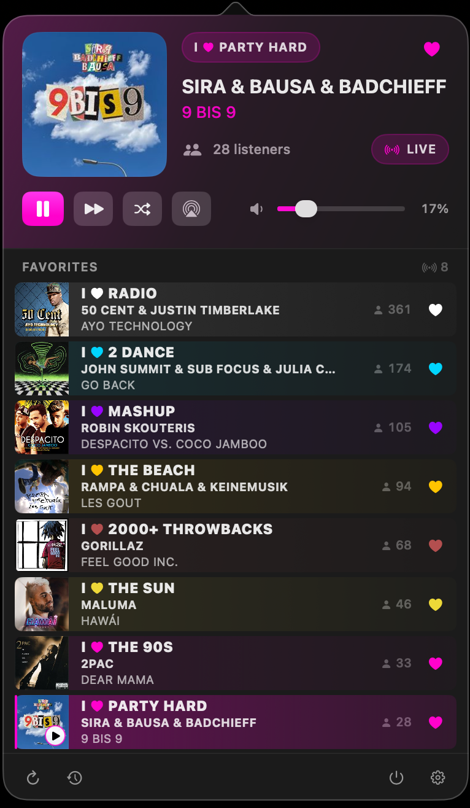
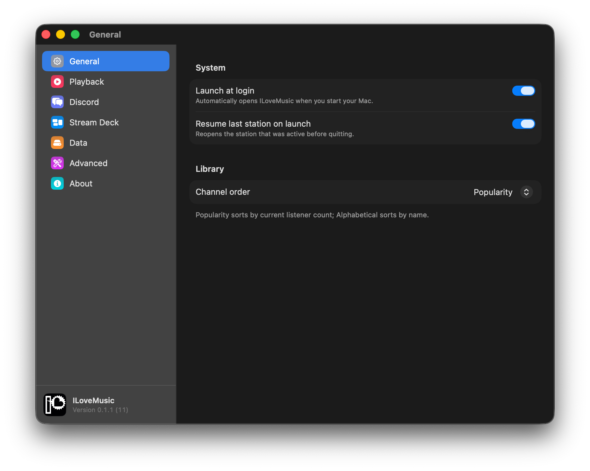
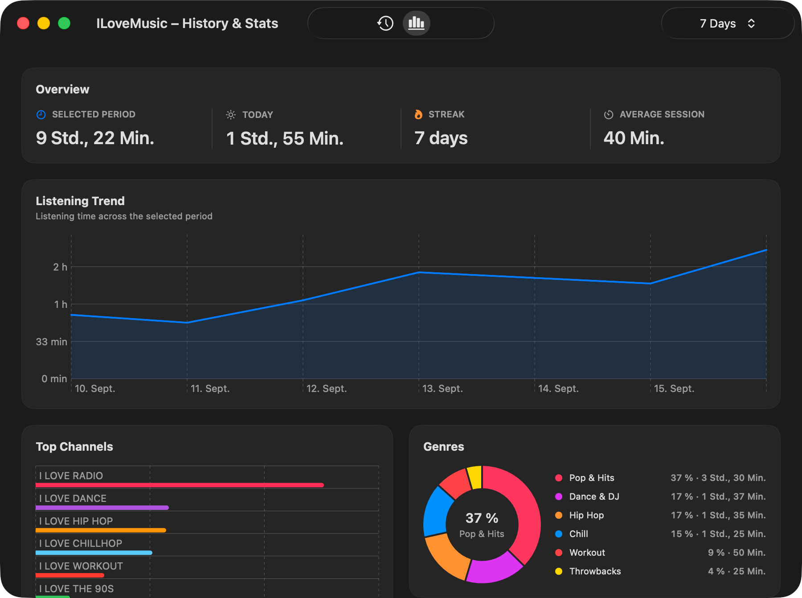
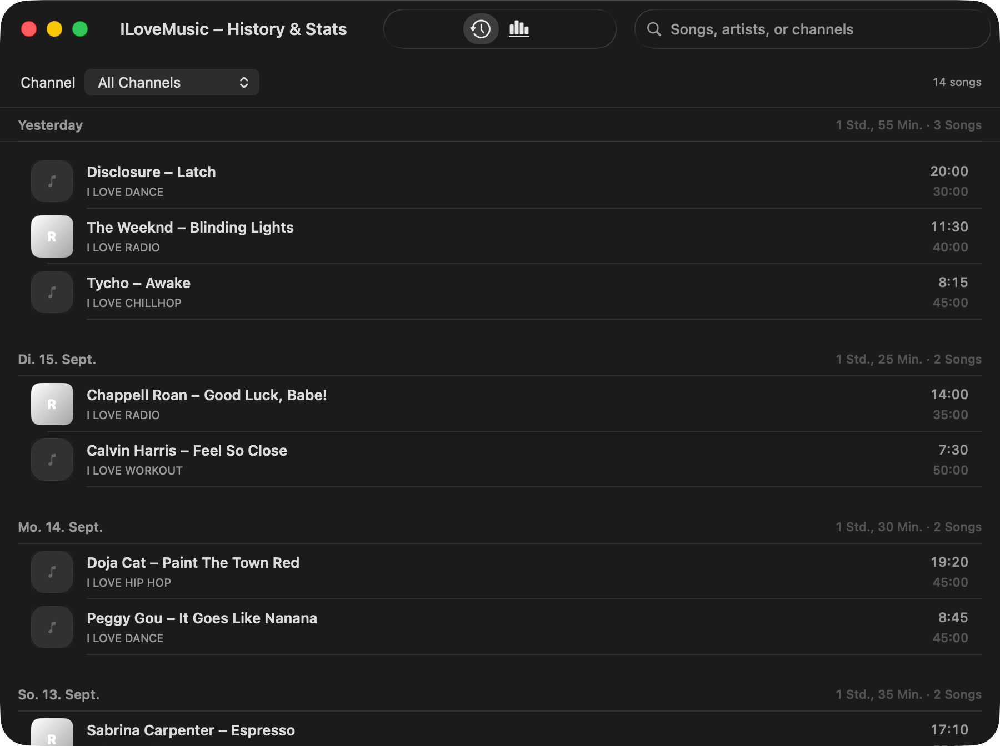
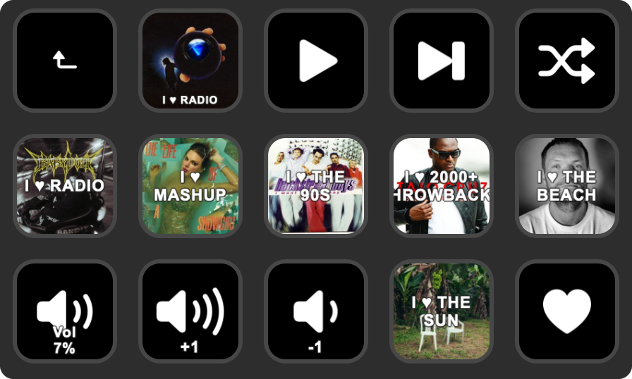
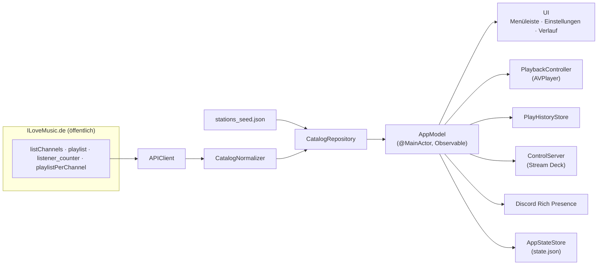

<div align="center">

# ILoveMusic für macOS

**Nativer Menüleisten-Player für die öffentlichen ILoveMusic-Radiostreams.**
<br>
Lokal-first, ohne Account, ohne Cloud, ohne eigenes Backend – gebaut nur auf den öffentlichen ILoveMusic-Daten.

[](https://www.apple.com/macos/)
[](https://swift.org)
[](https://developer.apple.com/xcode/swiftui/)
[](#architektur)
[](#tests)
[](LICENSE)

[Überblick](#überblick) • [Installation](#installation) • [Schnellstart](#schnellstart) • [Einstellungen](#einstellungen) • [Stream Deck](#stream-deck) • [Architektur](#architektur) • [Live-Daten](#live-daten) • [Tests](#tests)



</div>

## Überblick

ILoveMusic ist ein nativer macOS-App, der in der **Menüleiste** lebt. Ein Klick auf das Symbol öffnet ein kompaktes Player-Panel mit aktivem Sender, Favoriten und der vollständigen Senderliste samt Live-Metadaten.

ILoveMusic.de stellt seine Sender-, Metadaten- und Hörerzahlen über **öffentliche Endpunkte** bereit. Diese App baut darauf einen nativen Player – **ohne** eigenen Server, ohne Benutzerkonten, ohne Cloud-Sync.

Das Projekt bleibt bewusst:

- **macOS-first** – AppKit-Menüleisten-Shell mit SwiftUI-Inhalten.
- **lokal-first** – Favoriten, Verlauf und Statistik liegen nur auf diesem Mac.
- **menüleisten-first** – kein Hauptfenster, kein Dock-Symbol (standardmäßig).
- **fast abhängigkeitsfrei** – [Sparkle](https://sparkle-project.org/) für In-App-Updates ist das einzige externe Swift-Paket; selbst die Discord-Anbindung ist von Hand auf `Network` gebaut.

> Inoffizielles Hobbyprojekt. Es konsumiert ausschließlich öffentlich erreichbare ILoveMusic-Daten und steht in keiner Verbindung zu I Love Music GmbH.

## Highlights

- **Menüleisten-Player** – Now-Playing-Hero mit Cover, Künstler/Titel, Live-Hörerzahl, Play/Pause, nächstem Sender, Zufallssender, AirPlay-Ausgabe und Lautstärkeregler.
- **Live-Senderkatalog** – Discovery direkt aus den öffentlichen ILoveMusic-Endpunkten, mit Sichtbarkeitsfilter und gebündeltem Fallback-Seed.
- **Favoriten** – pro Sender, farbcodiert nach Kategorie, mit Live-Hörerzahlen.
- **Verlauf & Statistik** – eigenes Fenster mit Streak, Genre-Verteilung, Top-Sendern/Künstlern/Songs, 24-Stunden- und Wochentag×Stunde-Heatmaps.
- **Native Wiedergabe** – `AVPlayer` mit AAC→MP3→`.m3u`-Fallback und automatischem Reconnect.
- **Konfigurierbare globale Tastenkürzel** – funktionieren systemweit, jede Aktion frei belegbar mit Konflikterkennung.
- **Deutsch und Englisch** – folgt standardmäßig der macOS-App-Sprache oder lässt sich in den Einstellungen fest auswählen.
- **Discord Rich Presence** – optional; zeigt Sender, Song, Cover und Hörerzahl im Discord-Profil.
- **[Stream Deck](#stream-deck)** – eigenes Plugin über einen lokalen, token-gesicherten HTTP-Control-Server: Sender-Tasten mit Live-Cover, Transport, Favorit, Lautstärke.
- **Start bei Anmeldung** und **letzten Sender fortsetzen**.

## Voraussetzungen

- macOS 14 oder neuer
- Xcode 26.x bzw. eine aktuelle Apple-Swift-6.2-Toolchain

Lokal verifiziert mit Xcode 26.3 / Apple Swift 6.2.4.

## Installation

Fertige Builds liegen unter [Releases](https://github.com/nichtlegacy/ilovemusic_mac/releases). Die App ist **Apple Silicon only** (arm64) und braucht macOS 14 oder neuer.

1. `ILoveMusic-<version>.dmg` herunterladen und öffnen.
2. `ILoveMusic.app` in den Ordner `Programme` ziehen.
3. Quarantäne entfernen – siehe direkt unten.
4. App starten. Das Symbol erscheint in der Menüleiste, ein Fenster öffnet sich nicht.

### Gatekeeper beim ersten Start

Dieses Projekt hat keinen Apple-Developer-Account. Die App ist deshalb nur **ad-hoc signiert und nicht notarisiert**. macOS blockiert sie beim ersten Start mit der Meldung, die App sei beschädigt oder stamme von einem nicht verifizierten Entwickler. Das ist erwartet und kein Defekt des Downloads.

Zwei Wege, das freizugeben:

**Terminal (ein Befehl):**

```bash
xattr -dr com.apple.quarantine /Applications/ILoveMusic.app
```

**Ohne Terminal:** App einmal per Doppelklick starten, die Warnung bestätigen, dann *Systemeinstellungen → Datenschutz & Sicherheit* öffnen und dort unten auf *Trotzdem öffnen* klicken.

Nur der erste Start ist betroffen. Spätere Updates über Sparkle laufen ohne diesen Schritt.

### Updates

ILoveMusic aktualisiert sich über [Sparkle](https://sparkle-project.org/). Updates werden per EdDSA-Signatur geprüft, unabhängig von Apples Notarisierung.

- Automatische Prüfung im Hintergrund, abschaltbar unter *Einstellungen → Über → Updates*.
- Manuelle Prüfung dort per *Nach Updates suchen…* oder über das Rechtsklick-Menü in der Menüleiste.
- Update-Feed: [`appcast.xml`](appcast.xml)

## Schnellstart

```bash
git clone https://github.com/nichtlegacy/ilovemusic_mac.git
cd ilovemusic_mac

swift build      # bauen
swift run ILoveMusic   # starten
swift test       # 133 Tests
```

Nach dem Start erscheint **kein Fenster** – ILoveMusic setzt ein Symbol in die Menüleiste (`NSStatusItem`). Linksklick öffnet das Player-Panel, Rechtsklick zeigt ein natives Menü mit Wiedergabe-, Aktualisieren-, Verlauf-, Einstellungen- und Beenden-Aktionen. Das Dock-Symbol ist standardmäßig aus (`setActivationPolicy(.accessory)`).

> In stark sandbox-eingeschränkten Umgebungen kann SwiftPM die Standard-Cache-Pfade nicht schreiben. Dann die Variante aus [Fehlerbehebung](#fehlerbehebung) verwenden.

### In Xcode öffnen

1. Xcode öffnen
2. [`Package.swift`](Package.swift) öffnen
3. Schema `ILoveMusic` wählen und ausführen

## Einstellungen

<div align="center">

</div>

Die Einstellungen öffnen in einem eigenen nativen macOS-Fenster mit sieben Bereichen in der Sidebar. Fensterposition, Größe und der zuletzt gewählte Bereich bleiben erhalten.

<details>
<summary><b>Tabs und globale Tastenkürzel im Detail</b></summary>

<br>

| Tab | Inhalt |
| --- | --- |
| **General** | Start bei Anmeldung · letzten Sender fortsetzen · Sprache (Systemstandard/Deutsch/English) · Sender-Reihenfolge (Beliebtheit/Alphabet) |
| **Playback** | Standard-Lautstärke (perzeptuelle Kurve, Stummschalten, „Maximallautstärke entsperren") · globale Tastenkürzel ein/aus · pro-Aktion belegbare Hotkeys mit Konflikterkennung |
| **Discord** | Rich Presence ein/aus · Cover senden · „Listen"-Button · Hörerzahl anzeigen · Senderlogo · eigene Discord-Application-ID |
| **Stream Deck** | Status der lokalen HTTP-Brücke · letzter Request/Handshake · letzter Fehler |
| **Data** | Quelle, letzte Aktualisierung, sichtbare/gefilterte Sender · Verlauf aufzeichnen und zurücksetzen |
| **Advanced** | Manuelle Aktualisierung · Katalog- und Cover-Cache · Katalogdiagnose · Discord- und Stream-Deck-Logs |
| **About** | App-Version und Build · Sparkle-Updates · Projektlinks |

**Globale Tastenkürzel** — jede Aktion ist frei belegbar (in **Playback** aufnehmen); die Standardbelegung:

| Aktion | Standard |
| --- | --- |
| Play / Pause | `⌥⌘P` |
| Nächster Sender | `⌥⌘N` |
| Zufallssender | `⌥⌘R` |
| Beenden | `⌥⌘Q` |

Registriert über die Carbon-`RegisterEventHotKey`-API in [`GlobalShortcutManager.swift`](Sources/ILoveMusic/Services/GlobalShortcutManager.swift).

</details>

### Sprache

ILoveMusic unterstützt Deutsch und Englisch. Standardmäßig folgt die Oberfläche der macOS-App-Sprache. Unter **Einstellungen → Allgemein → System → Sprache** kann Deutsch oder Englisch fest gewählt werden. Die Auswahl wird sofort gespeichert. Mit **ILoveMusic neu starten** übernimmt die App die neue Sprache direkt.

Übersetzungen werden in `Sources/ILoveMusic/Resources/Localizable.xcstrings` gepflegt. Nach Änderungen die eingecheckten Laufzeit-Ressourcen für `swift run` und `swift test` neu erzeugen:

```bash
xcrun xcstringstool compile Sources/ILoveMusic/Resources/Localizable.xcstrings \
  --output-directory Sources/ILoveMusic/Resources --language en --language de
```

## Verlauf & Statistik

Ein eigenes `NSWindow` (auf Anforderung erzeugt) zeigt Verlauf und aggregierte Hörstatistik. Der Verlauf basiert auf lokal protokollierten Play-Events; nichts verlässt den Mac.

<div align="center">

<br>
<sub>Statistik mit frei wählbarem Zeitraum</sub>
</div>

<br>

<div align="center">

<br>
<sub>Hörverlauf mit Suche und Senderfilter</sub>
</div>

Enthalten: Heute/Woche/Monat/Streak-Karten, Top-Sender, Genre-Verteilung, Hör-Trend, 24-Stunden-Verteilung, Wochentag×Stunde-Heatmap, Top-Künstler und Top-Songs – mit Zeitraum-Auswahl und Umschalter zwischen Verlauf und Statistik.

## Discord Rich Presence

Optional und ausgeschaltet per Default. Aktiviert, zeigt es den aktuellen Sender, Song, optional das Cover und die Live-Hörerzahl im Discord-Profil; ein optionaler „Listen"-Button verlinkt direkt auf den Sender bei ilovemusic.de.

Du hinterlegst eine **eigene** Discord-Application-ID (developer.discord.com → Applications → New Application). Die IPC-Verbindung ist von Hand auf das `Network`-Framework gebaut – keine externe Discord-Bibliothek.

## Stream Deck

Ein eigenes Stream-Deck-Plugin steuert den Player direkt vom Deck: Wiedergabe, Sender, Favoriten und Lautstärke – mit Live-Cover und Hörerzahl auf den Tasten.

Plugin-Repository: **[nichtlegacy/ilovemusic_streamdeck](https://github.com/nichtlegacy/ilovemusic_streamdeck)**

<div align="center">

</div>

### Was das Plugin kann

- **Sender-Tasten** – jede Taste ein fester Sender, mit aktuellem Cover als Tastenbild; die aktive Taste ist hervorgehoben.
- **Transport** – Play/Pause, nächster Sender, Zufallssender (wahlweise nur aus den Favoriten).
- **Favorit umschalten** – Herz-Taste für den gerade laufenden Sender.
- **Lautstärke** – absoluter Wert, Schrittweise `+1`/`-1`, Stummschalten; eine Anzeige-Taste zeigt den aktuellen Pegel in Prozent.

### Wie die Verbindung läuft

Die App hält **keine** dauerhafte Stream-Deck-Verbindung offen. Stattdessen startet sie einen lokalen HTTP-Control-Server und legt einen Handshake unter `~/Library/Application Support/ILoveMusic/control.json` ab:

```json
{ "port": 51234, "token": "…", "version": 2 }
```

Das Plugin liest diese Datei und ruft damit die lokalen Endpunkte auf. Nach einem Disconnect oder App-Neustart sendet es frische Requests – Port und Token werden bei jedem Start neu vergeben. Status und letzter Request stehen unter **Einstellungen → Stream Deck**, das Verbindungslog unter **Einstellungen → Advanced**.

Absicherung des Servers:

- Bindet nur auf **Loopback** (`127.0.0.1`), nie auf eine externe Schnittstelle.
- **Bearer-Token** pro App-Start, im Konstantzeit-Vergleich geprüft.
- **Host-Header-Prüfung** gegen DNS-Rebinding; alles außer `127.0.0.1:<port>` / `localhost:<port>` bekommt `403`.
- Handshake-Datei mit Modus `0600`, beim Beenden gelöscht.

### Installation

1. ILoveMusic starten – der Control-Server läuft automatisch, sobald die App aktiv ist.
2. Das Plugin aus den [Releases des Plugin-Repositories](https://github.com/nichtlegacy/ilovemusic_streamdeck/releases) installieren (`.streamDeckPlugin` doppelklicken).
3. Aktionen aus der Kategorie **ILoveMusic** auf Tasten ziehen; Sender-Tasten bekommen ihren Sender in der Inspector-Ansicht zugewiesen.
4. Im Tab **Einstellungen → Stream Deck** prüfen, ob Handshake und letzter Request erscheinen.

<details>
<summary><b>HTTP-Endpunkte (für eigene Clients)</b></summary>

<br>

Alle Requests brauchen `Authorization: Bearer <token>` aus `control.json`.

| Methode | Pfad | Wirkung |
| --- | --- | --- |
| `GET` | `/v1/state` | Snapshot: aktiver Sender, Song, Wiedergabestatus, Hörerzahl, Favorit |
| `GET` | `/v1/stations` | sichtbare Sender inkl. IDs für `/v1/select` |
| `GET` | `/v1/volume` | aktuelle Lautstärke und Mute-Zustand |
| `POST` | `/v1/toggle` | Play/Pause umschalten |
| `POST` | `/v1/play` · `/v1/pause` | explizit starten/pausieren |
| `POST` | `/v1/next` | nächster Sender |
| `POST` | `/v1/random` | Zufallssender · Body `{"favoritesOnly": true}` optional |
| `POST` | `/v1/select` | Body `{"stationId": "…"}` |
| `POST` | `/v1/favorite` | Favorit des laufenden Senders umschalten |
| `POST` | `/v1/volume` | Body `{"volume": 0…100}` |
| `POST` | `/v1/volume/step` | Body `{"delta": -100…100}` |
| `POST` | `/v1/mute` | ohne Body: umschalten · Body `{"muted": true}` setzt explizit |

Antworten: `204` bei Mutationen, JSON bei `GET`, `400` bei ungültigem Body, `401` ohne gültiges Token, `409` wenn `/v1/random` keinen Sender findet.

Beispiel:

```bash
TOKEN=$(python3 -c 'import json;print(json.load(open("'"$HOME"'/Library/Application Support/ILoveMusic/control.json"))["token"])')
PORT=$(python3 -c 'import json;print(json.load(open("'"$HOME"'/Library/Application Support/ILoveMusic/control.json"))["port"])')

curl -s -H "Authorization: Bearer $TOKEN" "http://127.0.0.1:$PORT/v1/state"
curl -s -X POST -H "Authorization: Bearer $TOKEN" "http://127.0.0.1:$PORT/v1/toggle"
```

</details>

## Architektur

Schicht-Übersicht:



| Schicht | Verantwortung | Ort |
| --- | --- | --- |
| **App** | `@main`-Szene, `AppDelegate` (Statusitem, Popover, Menü), `AppModel`-Orchestrator | [`App/`](Sources/ILoveMusic/App) |
| **Domain** | `Station`, `NowPlaying`, `PlaybackState`, `UserPreferences`, Hotkeys, History-/Stats-Modelle | [`Domain/`](Sources/ILoveMusic/Domain) |
| **Data** | DTO-Decoding, API-Client, Normalisierung, Repositories, Recent-Tracks-XML | [`Data/`](Sources/ILoveMusic/Data) |
| **Persistence** | lokale JSON-Persistenz (`state.json`, `play_events.jsonl`, `control-log.json`) | [`Persistence/`](Sources/ILoveMusic/Persistence) |
| **Services** | `AVPlayer`-Wiedergabe, Refresh-Koordinator/-Pipeline, Preferences-Koordinator, Stats-Provider, globale Hotkeys, Start-bei-Anmeldung, Control-Server, History-Recorder, Discord | [`Services/`](Sources/ILoveMusic/Services) |
| **UI** | Menüleisten-Panel, Einstellungs-Panes, Verlauf-/Statistik-Fenster, Charts | [`UI/`](Sources/ILoveMusic/UI) |
| **Support** | App-Identität/Pfade, Menüleisten-Glyph, Keychain, Styling, Extensions | [`Support/`](Sources/ILoveMusic/Support) |

## Live-Daten

Die App konsumiert ausschließlich öffentliche ILoveMusic-Endpunkte:

| Zweck | Endpunkt |
| --- | --- |
| Senderkatalog (Discovery, Stream-URLs, Branding) | `…/Scripts/listChannels.php` |
| Now-Playing-Metadaten (Künstler, Titel, Cover, Akzentfarbe) | `…/Scripts/playlist.php` |
| Hörerzahlen (Beliebtheit, Live-Status) | `…/fileadmin/user_upload/listener_counter.json` |
| Zuletzt gespielte Titel pro Sender (XML) | `…/Scripts/playlistPerChannel.php` |

### Katalog-Strategie

Der Katalog wird aus vier Quellen gebaut: live `listChannels.php`, live `playlist.php`, live Hörerzahlen sowie dem gebündelten Fallback in [`Resources/stations_seed.json`](Sources/ILoveMusic/Resources/stations_seed.json).

- Live-Endpunkte sind maßgeblich; der Seed dient nur als Fallback und Metadaten-Backfill.
- Sender laufen durch eine lokale Sichtbarkeitsregel ([`Resources/visibility_policy.json`](Sources/ILoveMusic/Resources/visibility_policy.json)).
- Aktualisierungsintervalle: Katalog alle **15 min**, Hörerzahlen alle **2 min**, Now-Playing alle **30 s**.

### Wiedergabe-Strategie

Native Wiedergabe über `AVPlayer`. Stream-Reihenfolge: **AAC → MP3 → abgeleiteter `.m3u`-Fallback**. Wiedergabezustände: `idle`, `buffering`, `playing`, `paused`, `reconnecting`, `failed` (siehe [`PlaybackController.swift`](Sources/ILoveMusic/Services/PlaybackController.swift)).

## Persistenz

Lokal unter `~/Library/Application Support/ILoveMusic/`:

- `state.json` – Einstellungen, Verlauf, Sender- und Metadaten-Cache
- `play_events.jsonl` – Append-only-Hörereignisse (eine JSON-Zeile pro Event)
- `control.json` – Handshake des Control-Servers (Port und Token für Stream Deck)
- `control-log.json` – rollierendes Diagnoselog des Control-Servers
- `discord-log.json` – rollierendes Diagnoselog der Discord-Anbindung

Außerhalb davon legt macOS selbst noch ab:

- `~/Library/Preferences/com.nichtlegacy.ILoveMusic.plist` – Sparkle-Einstellungen und Fensterposition
- `~/Library/Saved Application State/com.nichtlegacy.ILoveMusic.savedState/`
- `~/Library/HTTPStorages/com.nichtlegacy.ILoveMusic/` – URLSession-Cache für Cover und Feeds
- `~/Library/Caches/com.nichtlegacy.ILoveMusic/`
- Login-Item (`SMAppService`), falls *Start bei Anmeldung* aktiv war

Nicht angelegt werden: Einträge im Schlüsselbund, Dateien in `~/Documents` und eigene `UserDefaults` außerhalb des Sparkle-Bereichs.

## Deinstallation

<details>
<summary><b>Rückstandsfreies Entfernen</b></summary>

<br>

**Schritt 1 – vorher in der App:** *Einstellungen → General → Start bei Anmeldung* deaktivieren und die App beenden. Sonst bleibt das Login-Item bei `SMAppService` registriert und lässt sich danach nur noch über *Systemeinstellungen → Allgemein → Anmeldeobjekte* entfernen.

**Schritt 2 – App löschen:**

```bash
rm -rf /Applications/ILoveMusic.app
```

**Schritt 3 – lokale Daten löschen.** Alle Pfade gehören eindeutig zu dieser App; die drei Cache-Ordner tragen die Bundle-ID `com.nichtlegacy.ILoveMusic` im Namen:

```bash
rm -rf ~/Library/Application\ Support/ILoveMusic
rm -rf ~/Library/Caches/com.nichtlegacy.ILoveMusic
rm -rf ~/Library/HTTPStorages/com.nichtlegacy.ILoveMusic
rm -rf ~/Library/Saved\ Application\ State/com.nichtlegacy.ILoveMusic.savedState
defaults delete com.nichtlegacy.ILoveMusic 2>/dev/null
```

Der Ordner `~/Library/Application Support/ILoveMusic` trägt als einziger keine Bundle-ID im Namen – vor dem Löschen einmal hineinschauen (`ls ~/Library/Application\ Support/ILoveMusic`), erwartet werden nur `state.json`, `play_events.jsonl` sowie die `control*`/`discord-log`-Dateien.

`defaults delete` ist hier `rm` auf der `.plist` vorzuziehen, weil `cfprefsd` den Inhalt im Speicher hält und eine gelöschte Datei sonst zurückschreibt.

**Kein Schlüsselbund-Eintrag.** Die App legt zur Laufzeit nichts im Schlüsselbund ab – dort steht nur der private Sparkle-Signaturschlüssel, und den gibt es ausschließlich auf der Maschine, die Releases baut. Beim Deinstallieren ist im Schlüsselbund also nichts zu tun.

</details>

## Projektstruktur

```text
ilovemusic_mac/
├── Package.swift            # SwiftPM-Manifest (einzige Abhängigkeit: Sparkle)
├── VERSION                  # Marketing-Version
├── appcast.xml              # Sparkle-Update-Feed
├── .github/
│   ├── workflows/ci.yml     # Tests + Bundle + DMG bei jedem Push
│   └── release-notes/       # Release-Notes je Version (GitHub + Sparkle-Dialog)
├── Scripts/
│   ├── build-app.sh         # .app-Bundle bauen (arm64, ad-hoc signiert)
│   ├── package-dmg.sh       # DMG packen
│   ├── release.sh           # Release schneiden: bauen, taggen, publishen
│   ├── update-appcast.py    # appcast.xml mit EdDSA-Signatur aktualisieren
│   └── backup-sparkle-key.sh
├── Sources/ILoveMusic/
│   ├── App/                 # @main-Szene, AppDelegate, AppModel
│   ├── Data/
│   │   ├── Clients/         # APIClient
│   │   ├── DTO/             # Decoding der öffentlichen Endpunkte
│   │   ├── Normalization/   # CatalogNormalizer, Sichtbarkeitsregel
│   │   ├── Parsing/         # Recent-Tracks-XML
│   │   └── Repositories/    # CatalogRepository & Co.
│   ├── Domain/              # Station, NowPlaying, Preferences, Hotkeys, Stats
│   ├── Persistence/         # JSON-Stores (state, play_events, Diagnoselogs)
│   ├── Resources/           # stations_seed.json, visibility_policy.json, AppIcon, AppLogo
│   ├── Services/            # Wiedergabe, Refresh, Hotkeys, Control-Server, Discord
│   ├── Support/             # AppIdentity/Pfade, Glyph, Keychain, Styling
│   └── UI/
│       ├── Components/      # geteilte Bausteine
│       ├── History/         # Verlauf & Statistik (+ Charts/)
│       ├── MenuBar/         # Player-Panel
│       └── Settings/        # Panes/ und Components/
├── Tests/ILoveMusicTests/   # 133 Tests (swift-testing)
└── docs/screenshots/        # Bilder für dieses README
```

## Tests

133 Tests über 24 Dateien unter [`Tests/ILoveMusicTests`](Tests/ILoveMusicTests), basierend auf dem `swift-testing`-Framework. Abdeckung u. a.: Live-DTO-Decoding, Katalog-Normalisierung & Sichtbarkeitsfilter, Recent-Tracks-XML-Parsing, Lautstärke-/Control-Server-Flows, Verlaufs-Recording und Stats-Aggregation, Lokalisierung und App-Neustart, Discord-IPC/-Presence, App-Support-Pfade, Persistenz-Verträge sowie Menüleisten- und Einstellungs-Audits.

```bash
swift test
```

## Fehlerbehebung

<details>
<summary><b>Häufige Fälle</b></summary>

<br>

**Kein Dock-Symbol nach Start.** Erwartetes Verhalten – ILoveMusic lebt in der Menüleiste.

**Keine Live-Sender.** Netzwerkzugriff und Erreichbarkeit der öffentlichen ILoveMusic-Endpunkte prüfen. Bei fehlgeschlagener Aktualisierung greift der gebündelte/gecachte Fallback.

**Start bei Anmeldung tut nichts im Dev-Modus.** Greift erst in einer regulär gebündelten/signierten App-Installation – nicht beim direkten `swift run`.

**Stream Deck reagiert nicht.** ILoveMusic muss laufen; `~/Library/Application Support/ILoveMusic/control.json` existiert nur, solange die App aktiv ist. Port und Token wechseln bei jedem Start – das Plugin muss die Datei neu lesen. Das Log steht unter **Einstellungen → Advanced**.

**SwiftPM-Cache-Warnungen in Sandbox-Umgebungen.** Reproduzierbarer Build mit explizit gesetzten Cache-Pfaden:

```bash
mkdir -p .build/module-cache .build/swiftpm-cache
SWIFTPM_ENABLE_PLUGINS=0 \
SWIFTPM_CACHE_PATH=$PWD/.build/swiftpm-cache \
CLANG_MODULE_CACHE_PATH=$PWD/.build/module-cache \
SWIFT_MODULECACHE_PATH=$PWD/.build/module-cache \
swift build --disable-sandbox
```

(`swift run`/`swift test` analog mit `--disable-sandbox`.)

</details>

## Release

Releases werden lokal geschnitten, weil der private Sparkle-Signaturschlüssel im Schlüsselbund dieses Macs liegt und nicht in GitHub-Secrets gehört.

```bash
Scripts/build-app.sh          # .build/ILoveMusic.app (arm64, ad-hoc signiert)
Scripts/package-dmg.sh        # dist/ILoveMusic-<version>.dmg
Scripts/release.sh --version 0.2.0 --dry-run   # zeigt jeden Schritt, ohne zu veröffentlichen
Scripts/release.sh --version 0.2.0             # baut, taggt, published, aktualisiert appcast.xml
```

Versionierung:

- **Marketing-Version** steht in [`VERSION`](VERSION) und geht als `CFBundleShortVersionString` ins Bundle.
- **Buildnummer** ist die Commit-Anzahl (`git rev-list --count HEAD`) und geht als `CFBundleVersion` ins Bundle. Sie steigt damit bei jedem Commit monoton, was Sparkle für den Versionsvergleich braucht.
- Beides lässt sich für Sonderfälle per `VERSION=` bzw. `BUILD_NUMBER=` überschreiben.

Release-Notes pro Version liegen unter `.github/release-notes/<version>.md`; die Stichpunkte landen sowohl im GitHub-Release als auch im Sparkle-Update-Dialog.

## Hinweise für die Entwicklung

- Kein eigenes Backend hinzufügen, solange sich die Produktrichtung nicht explizit ändert – nur die öffentlichen ILoveMusic-Endpunkte als Live-Quelle.
- Das menüleisten-first-Interaktionsmodell beibehalten.

## Lizenz & Haftungsausschluss

Veröffentlicht unter der [MIT-Lizenz](LICENSE) – © 2026 nichtlegacy.

Inoffizielles, nicht-kommerzielles Hobbyprojekt. „ILoveMusic" / „I Love Music" sowie Sender, Logos und Marken gehören ihren jeweiligen Inhabern. Diese App nutzt ausschließlich öffentlich erreichbare Daten und steht in keiner Verbindung zu I Love Music GmbH.

- Projekt: <https://github.com/nichtlegacy/ilovemusic_mac>
- ILoveMusic: <https://ilovemusic.de/>
</content>
</invoke>
